# alena-gateway

One front door for everything running on `alena-server`.

Three applications share the machine, each on its own loopback port. This routes
them under one tailnet origin by path, keeps the iOS app's endpoint where the
shipped builds expect to find it, and puts a status page at the root that says
what is up and links to each of them.

    https://alena-server.your-tailnet.ts.net/

---

## The estate

| Path | Application | Upstream | Repo |
|---|---|---|---|
| `/` | Status page | `127.0.0.1:8090` | this repo |
| `/health-app/` | Health Exporter dashboard | `/var/www/health-dashboard` on disk | [health-app](../health-app) |
| `/athena/` | Athena | `127.0.0.1:8099` | [project-athena](../project-athena) |
| `/luma-index/` | LumaIndex | `127.0.0.1:8080` | [luma-index](../luma-index) |

Plus four root paths that belong to health-app rather than to the gateway —
see [Root reservations](#root-reservations).

---

## Architecture

```mermaid
flowchart TB
    iphone["iPhone<br/>Health Exporter app"]
    browser["Browser"]

    subgraph host["alena-server"]
        direction TB

        ts["tailscale serve :443<br/>terminates TLS<br/>the only routable listener"]
        ngx["nginx 127.0.0.1:8088<br/>the gateway<br/>routes by path prefix"]

        subgraph gw["alena-gateway"]
            status["status service :8090<br/>FastAPI + static page"]
        end

        subgraph ha["health-app"]
            hdash[("/var/www/health-dashboard<br/>static SPA on disk")]
            hweb["Django + gunicorn :8081"]
            hdb[("Postgres")]
        end

        subgraph at["project-athena"]
            aweb["Nuxt BFF :8099"]
            aapi["FastAPI core :8100"]
            adb[("Postgres")]
        end

        subgraph li["luma-index"]
            caddy["Caddy :8080"]
            lfe["Nuxt :3000"]
            lbe["Django :8000"]
            ldb[("Postgres")]
        end
    end

    iphone  -- "POST /v1/health/batches" --> ts
    browser -- "https" --> ts
    ts      -- "http · loopback" --> ngx

    ngx -- "/" --> status
    ngx -- "/health-app/*" --> hdash
    ngx -- "/v1/* · /healthz<br/>/admin/* · /static/*" --> hweb
    ngx -- "/athena/*<br/>prefix passed through" --> aweb
    ngx -- "/luma-index/*<br/>prefix passed through" --> caddy
    ngx -- "/luma-index/api · /admin · /static<br/>prefix stripped" --> caddy

    status -. "health probes" .-> hweb
    status -.-> aweb
    status -.-> aapi
    status -.-> caddy

    hweb --> hdb
    aweb --> aapi
    aapi --> adb
    caddy --> lfe
    caddy --> lbe
    lbe --> ldb

    classDef edge fill:#e8f0fe,stroke:#4a6fa5,stroke-width:2px
    classDef store fill:#f4f4f4,stroke:#999
    class ts,ngx edge
    class hdb,adb,ldb,hdash store
```



**Two layers, one job each.** `tailscale serve` owns TLS and identity: it holds
a real certificate for the MagicDNS name and is the only thing on the box
listening on a routable address. nginx owns routing and nothing else — it
listens on `127.0.0.1:8088`, so even though the host has a public address, none
of this is reachable from the LAN or the internet.

That is a change from how the host used to work. nginx previously bound
`0.0.0.0:443` with a keypair it managed itself, and LumaIndex sat behind a
second `tailscale serve` listener on `:8443`. There is now one listener, one
certificate, and no renewal script.

---

## The sub-path problem

Two of these applications are Nuxt SSR apps and one is a Vite SPA. All three
were built assuming they owned the root of an origin, and all three write
absolute URLs — `/_nuxt/…`, `/assets/…`, `/api/…` — into the HTML they serve. A
proxy rule alone does not fix that: strip the prefix and the app renders asset
URLs the gateway does not serve; pass it through and the app does not recognise
its own routes.

Each is handled at the layer that actually knows the answer.

### health-app — one root path, and a per-request script name

The iOS app has `https://<origin>/v1/health/batches` compiled into builds that
are already on phones. That endpoint cannot move, so `/v1` stays at the root and
`/healthz` beside it.

Everything *else* about this app did move, and the mechanism is the interesting
part. `FORCE_SCRIPT_NAME` cannot help: it applies to a whole Django instance, so
prefixing the admin with it would prefix the ingest endpoint too. But
`X-Forwarded-Prefix` can. The gateway strips `/health-app` from the admin routes
and names it in that header; `ForwardedPrefixMiddleware` turns it into a
**per-request** `SCRIPT_NAME`, so one instance generates `/health-app/admin/…`
URLs on those requests while `/v1` keeps generating unprefixed ones. The header
is honoured only for a prefix in the app's own allowlist, so a client cannot
send one and choose the action on the admin's login form.

That freed `/admin` and `/static` from the origin root, where they looked shared
and were not — the second Django app on this origin would have collided with
both.

Note the asymmetry in the nginx site: the admin is proxied **stripped**, its
static tree **unstripped**. WhiteNoise matches the request path against
`STATIC_URL`, which is `/health-app/static/`, and only strips a prefix of its
own when `FORCE_SCRIPT_NAME` is set — which this app deliberately does not use.
Strip it there too and every admin stylesheet 404s.

The dashboard is a separate artifact — a static Vite build served straight off
disk — so it moved independently. Its `base` is `/health-app/`, and the API
calls inside it are root-absolute `/v1/…`, which keeps working unchanged.

| Change | Where |
|---|---|
| `base: '/health-app/'` | `server/dashboard/vite.config.js` |
| `ForwardedPrefixMiddleware`, allowlisted prefixes | `server/healthserver/settings.py` |
| Stops installing its own nginx vhost when the gateway is present | `server/deploy.sh` |

### athena — prefix passed through

Nuxt reads `app.baseURL` at runtime from `NUXT_APP_BASE_URL`, so the router, the
asset URLs and the prefix Nitro answers on all move together without rebuilding
the image. What Nuxt cannot see is a hand-written path, and Athena had three:
`$fetch('/api/…')` and two `EventSource('/api/events…')`.

| Change | Where |
|---|---|
| `NUXT_APP_BASE_URL: ${ATHENA_BASE_PATH:-/}` | `deploy/compose.yaml` |
| `ATHENA_BASE_PATH=/athena/` | `deploy/.env` |
| `apiUrl()` — one helper that prefixes the base path | `web/composables/useApi.ts` |
| Both `EventSource` call sites go through it | `web/composables/useEvents.ts`, `web/layouts/default.vue` |

nginx passes `/athena/*` through untouched, and gives `/athena/api/events` its
own rule: buffering off and a one-hour read timeout, because a buffered SSE
stream stops updating the page silently rather than failing visibly.

### luma-index — split down the middle

LumaIndex's two halves want opposite things, so the gateway gives them opposite
treatment.

**Nuxt needs the prefix passed through**, for the same reason Athena does.

**Django needs it stripped.** `FORCE_SCRIPT_NAME` changes the URLs Django
*builds* — DRF pagination links, admin redirects — but not the paths it
*routes*. A request still has to arrive as `/api/…` or the URLconf 404s. Setting
both, and stripping in the proxy, is what makes the API resolve *and* emit
prefixed links.

| Change | Where |
|---|---|
| `BASE_PATH`, `FORCE_SCRIPT_NAME`, prefixed `STATIC_URL` | `backend/config/settings.py` |
| `LUMA_BASE_PATH` to the backend; `NUXT_APP_BASE_URL` and `NUXT_PUBLIC_API_BASE` to the frontend | `compose.yaml` |
| Frontend healthcheck follows the base path | `compose.yaml` |
| `LUMA_BASE_PATH=/luma-index`, and `LUMA_PUBLIC_ORIGIN` loses its `:8443` | `.env` on the server |

`caddy/Caddyfile` is untouched: because the gateway strips the prefix on exactly
the routes Caddy splits off to Django, Caddy sees the same paths it always saw.

That frontend healthcheck is not a detail. The image's own check curls `/login`,
which stops existing the moment the app is given a base path — leaving the
container permanently unhealthy and Caddy, which waits on it, never starting.

---

## Root reservations

Everything at the root that is not listed here renders the status page.

| Path | Owner | Why it cannot move |
|---|---|---|
| `/v1/*` | health-app | Compiled into shipped iOS builds. The only genuinely stuck path here. |
| `/healthz` | health-app | Container healthcheck and `deploy.sh verify` |
| `/api/*` | gateway | The status JSON |

`/admin` and `/static` were on this list and are not any more — health-app's
per-request `SCRIPT_NAME` moved them under its prefix. `/icon.svg`,
`/favicon-32.png` and `/apple-touch-icon.png` were here too, redirecting to
prefixed copies because Nuxt does not rewrite head links from the base path;
LumaIndex now emits prefixed URLs for them itself, so the redirects were removed
rather than left as routes nothing reaches.

`services.yaml` is the record of this, and `./deploy/deploy.sh routes` fails if a
path declared there has no matching `location` in the nginx site.

---

## Deploy

```bash
cp .env.example .env                          # untracked; set GATEWAY_ORIGIN
echo my-ssh-host > deploy/.deploy-host        # untracked; names a machine
./deploy/deploy.sh
```

Both files are untracked on purpose: they name a specific machine, and this
repository is public. `services.yaml` carries a placeholder origin so a fresh
checkout still parses; `GATEWAY_ORIGIN` in `.env` is what actually applies, and
`deploy.sh` copies it to the server so a reboot restores the same links.

That checks the registry against the nginx site, runs the unit tests, syncs the
source, builds and starts the status service, installs the vhost (rolling back
if `nginx -t` rejects it), points `tailscale serve` at it, and probes every
route over the tailnet through real TLS.

| | |
|---|---|
| `./deploy/deploy.sh` | The whole thing. Idempotent — re-running is how you ship a change. |
| `./deploy/deploy.sh routes` | Registry vs. nginx site. Local, needs no host. |
| `./deploy/deploy.sh test` | The status service's unit tests. Local, no network. |
| `./deploy/deploy.sh nginx` | Reinstall the vhost and reload. Nothing else. |
| `./deploy/deploy.sh verify` | Probe every route end to end, then assert the status page reports every service up. Routing correctly and reporting correctly are different failures. |
| `./deploy/deploy.sh status` | Containers, then every upstream's health. |
| `./deploy/deploy.sh rollback` | List the images on the server. Add a tag to pin one. |
| `./deploy/deploy.sh logs` | Tail the status service. |

### Order matters on the first deploy

The gateway routes to applications that must already know their prefix. Deploy
them first, or their paths 404 until you do.

Both applications keep `.env` out of rsync so a local copy can never clobber the
server's, which means these two edits happen **on the server**:

```bash
ssh my-ssh-host
# Athena
printf '\nATHENA_BASE_PATH=/athena/\n' >> ~/athena/deploy/.env
# LumaIndex — add the prefix, and drop the :8443 the old serve listener needed
sudo sed -i 's|^LUMA_PUBLIC_ORIGIN=.*|LUMA_PUBLIC_ORIGIN=https://alena-server.your-tailnet.ts.net|' /opt/lumaindex/shared/.env
printf '\nLUMA_BASE_PATH=/luma-index\n' | sudo tee -a /opt/lumaindex/shared/.env
```

`LUMA_NUM_PROXIES` stays at `2`. nginx overwrites `X-Forwarded-For` rather than
adding a hop, so the chain Django sees is the length it always was.

Then, from this machine:

```bash
cd ../project-athena     && ./deploy/deploy.sh    # rebuilds web with apiUrl()
cd ../luma-index         && ./deploy/deploy.sh    # rebuilds frontend, restarts backend
cd ../health-app/server  && ./deploy.sh           # rebuilds the dashboard at /health-app/
cd ../../alena-gateway   && ./deploy/deploy.sh
```

health-app's deploy retires its own `health-exporter` vhost the first time it
runs with the gateway installed, so port 443 stops being contested. Set
`HEALTH_MANAGE_NGINX=1` to make it own the vhost again — correct only on a host
where this gateway is not deployed.

There is a window during this sequence where an application is configured for a
prefix nothing routes yet. Nothing is lost: the iOS app retries its batches, and
the browser-facing apps are simply unreachable until the gateway deploy lands.

---

## Tests

```bash
python3 -m venv backend/.venv
backend/.venv/bin/pip install -r backend/requirements-dev.txt
./deploy/deploy.sh test
```

45 tests, well under a second, no network: the probes run against an httpx
`MockTransport` keyed by upstream port, so every branch of the classification is
reachable without a live service. `deploy.sh` runs them before it touches
anything, and warns loudly rather than failing if pytest is not installed —
tests that quietly stop running are worse than none, because the green output
implies they passed.

What they pin down, and why each one is there rather than for coverage:

| | |
|---|---|
| **3xx is up** | Both Nuxt apps redirect an unauthenticated visitor to their login page. Classifying a redirect as a failure would have reported two healthy services permanently down. |
| **A sick component does not sink its parent** | Athena's dashboard being up while its core API is not is precisely the distinction the page exists to show. |
| **One dead upstream does not hide the others** | The probes are gathered concurrently; a bug in the fan-in would silently truncate the report. |
| **Concurrent callers share one probe cycle** | Several tabs on a cold cache must not each start a round. The stampede lands hardest when something has just gone down and every probe sits out its full timeout. |
| **Env origin beats the file** | `services.yaml` carries a placeholder so a real hostname never lands in a public repository. If the file ever won, a redeploy would silently undo that. |
| **Status is `no-store`** | The page is a live view; a cached copy is worse than useless because it looks current. |
| **An unknown page renders the status page, still 404** | A wrong path here is usually someone reaching for one of the apps, and the page lists them — but a soft 200 would tell a crawler the page exists. API paths keep JSON. |
| **An empty registry fails at startup** | The alternative renders nothing, which reads as "all is well" rather than "this is misconfigured". |

The suite was checked by mutation rather than by coverage: inverting the 3xx
rule, removing the cache lock, reversing the origin precedence, dropping the
`no-store` header, returning HTML for API 404s, and disabling the empty-registry
guard each turn it red.

`probes.py` takes an optional `transport` purely as a seam for this, and `Prober`
counts probe *cycles* rather than requests — a test that cannot see that number
can only assert on timing, which is how a cache test becomes flaky.

---

## Rollback

```bash
./deploy/deploy.sh rollback              # what is on the server
./deploy/deploy.sh rollback 983f7a2      # pin that one, then verify
```

Images are tagged by commit and kept on the server, so the previous few releases
are always there. The status service holds no state, which is what makes this a
complete rollback *of that service* — it re-runs the old image and then runs the
full verification pass before claiming anything.

**It does not revert the nginx site**, and the command says so rather than
implying otherwise. Routing is installed from the working tree, not baked into
the image, so a bad route is undone by checking the file out and reinstalling:

```bash
git checkout <tag> -- nginx/ services.yaml && ./deploy/deploy.sh nginx
```

An invalid site config cannot get that far — `deploy.sh` restores the previous
one and reloads nothing if `nginx -t` rejects it. This is for the config that is
valid and wrong.

---

## CI

`.github/workflows/ci.yml` runs on every push and pull request, in four jobs.

| | |
|---|---|
| **backend** | ruff, then pytest — on Python 3.12, matching `backend/Dockerfile`. Testing on a newer interpreter than production runs is how a deprecation becomes a deploy-time surprise. |
| **nginx** | `nginx -t` against the site inside `nginx:1.24`, the version the server runs, plus the registry-vs-site agreement check. |
| **shell** | ShellCheck on `deploy/deploy.sh`. |
| **compose** | `docker compose config`. |

The last three exist because the two bugs that reached production here were an
nginx directive and a compose networking mistake — neither of them something a
Python test can see. The nginx image is pinned rather than floating: a directive
can be valid in 1.27 and unknown in 1.24, which would pass CI and then fail on
the reload that matters.

---

## The sites this replaced

nginx on this host served three vhosts before the gateway. Deploying it retires
two of them — **disabled, not deleted**: both remain in `sites-available`, and
re-enabling either is one symlink.

| Site | What happened | Why |
|---|---|---|
| `health-exporter` | Retired | Superseded outright. The gateway routes `/v1`, `/healthz`, `/admin`, `/static` and `/health-app` to the same upstream. |
| `alena-voice` | Retired | Bound `0.0.0.0:443`, which holds every address on the box including the tailnet one, so `tailscale serve` could not take 443. It answered only for its own LAN address and its upstreams (`:8000`, `:3000`) were not running. |
| `default` | Left alone | `:80` only, so it collides with nothing. |

To bring `alena-voice` back on the LAN:

```bash
sudo ln -sfn /etc/nginx/sites-available/alena-voice /etc/nginx/sites-enabled/
sudo nginx -t && sudo systemctl reload nginx
```

That will fail while `tailscale serve` holds 443, because the site listens on
the wildcard address. Two ways out, and the first is safer:

- **Route it through the gateway** — give it `/alena-voice/` in
  `nginx/alena-gateway.conf` and an entry in `services.yaml`, the way the other
  three are done. It needs the same base-path treatment they did.
- **Bind it to the LAN address** — change `listen 443 ssl` to
  `listen 192.168.1.10:443 ssl`. Preserves it exactly, but nginx then refuses to
  start at all if the machine boots without that address, which would take the
  gateway and the health ingest down with it.

`./deploy/deploy.sh` refuses to hand 443 to `tailscale serve` while anything
still listens on it, rather than leaving serve half-configured and the origin
unreachable.

---

## The status page

A single page at the root, no build step, no dependencies. It polls
`/api/status` every 15 seconds, pauses while the tab is hidden, and renders each
service with its state, latency, upstream port and a link to itself.

State is carried by a word as well as a colour, the list is a polite live region
so a service going down is announced without stealing focus, and everything is
written with `textContent` — the strings include upstream error messages, and an
`httpx` exception is not a place to start trusting markup.

The backend probes concurrently, caches for five seconds, and collapses
concurrent refreshes behind a lock, so several open tabs do not multiply into
upstream traffic. Its own healthcheck deliberately does *not* probe the
upstreams: a check that failed when a different application was down would have
docker restart the gateway, taking the status page offline at the one moment it
is worth reading.

**It runs on the host's network namespace**, which is the one thing here that
looks like a shortcut and is not. Every application on this box binds
`127.0.0.1` on purpose. From inside a bridge network the probes leave by the
docker bridge and arrive on the host's *bridge* address, which those listeners
do not accept — the first deploy of this gateway reported all three services
down for exactly that reason, while every route was serving traffic correctly.
Sharing the namespace makes `127.0.0.1` mean the same thing to the prober as it
does to nginx. The alternative is asking three applications to bind `0.0.0.0`,
which would publish them to every network the host is on so that a status page
could work.

---

## Adding a service

1. Publish it on a free loopback port. `8080`, `8081`, `8090`, `8099`, `8100`,
   `2375` and `5432` are taken.
2. Add it to `services.yaml` — `prefix`, `port`, and a `health` path that
   answers without authentication.
3. Add a `location` block to `nginx/alena-gateway.conf`. Pass the prefix through
   for anything that renders its own URLs; strip it only for an API that builds
   none, or for one whose framework is told the prefix separately.
4. Teach the application its base path. If it cannot be told, it needs its own
   origin — path routing is not something a proxy can fake convincingly.
5. `./deploy/deploy.sh routes`, then `./deploy/deploy.sh`.

---

## Known edges

**LumaIndex's PWA install used to be broken here and is not any more.** Its
`manifest.webmanifest` was a static file with `start_url` baked in at build
time, so under a prefix it would have launched the status page instead of the
library; the gateway left it unrouted rather than let it lie. LumaIndex now
generates the manifest from a server route that reads the base path, so it is
correct at whatever prefix the app is served under, and the gateway needs no
special case for it.

**`X-Forwarded-For` is rewritten, not appended to.** Every application here
reads the first entry to identify a client, so appending would put a
caller-controlled value in the position a login rate limit trusts. nginx's
`real_ip` block resolves the true tailnet address first — taking the last entry
of what `tailscale serve` sends, which is correct whether tailscaled overwrites
the header or appends to it — and then passes exactly that one value on.

**LumaIndex still counts two proxies,** not three, and that is right: nginx
overwrites `X-Forwarded-For` rather than adding a hop, so the chain Django sees
is the same length it was before the gateway existed.

**`/favicon.ico` 404s.** Athena declares no favicon, so the browser falls back
to asking the origin root, where the gateway has nothing to give it — the status
page carries its own icon inline. Harmless, and it predates the gateway.

**Redirects must stay relative.** `absolute_redirect off` is load-bearing: nginx
otherwise builds `Location` from the scheme and port it is itself listening on,
which is plaintext `:8088`, an address reachable only from inside the host. The
deploy asserts on the `Location` header of four redirects for this reason.

**A second nginx site would collide on the `map`.** `$connection_upgrade` is
declared inside the gateway's site file because it is the only one on the host.
Add another and move that block to `conf.d/`.
